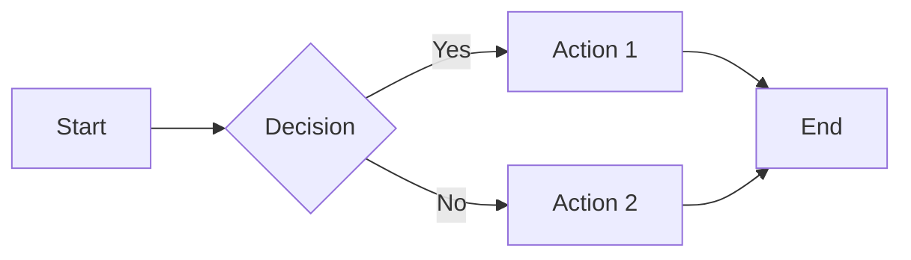
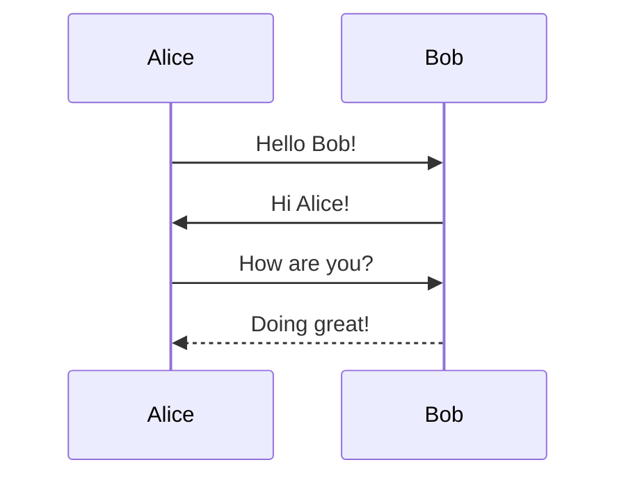
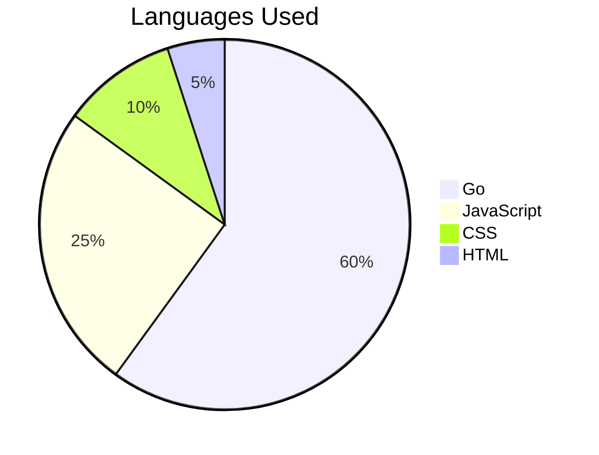

# Syntax Guide

A complete reference for all formatting features supported by GopherWiki.

## Text Formatting

| Syntax | Result |
|--------|--------|
| `**bold**` | **bold** |
| `*italic*` | *italic* |
| `~~strikethrough~~` | ~~strikethrough~~ |
| `==highlighted==` | ==highlighted== |
| `` `inline code` `` | `inline code` |

## Headings

```
# Heading 1
## Heading 2
### Heading 3
#### Heading 4
##### Heading 5
###### Heading 6
```

Headings automatically generate anchor links and appear in the table of contents sidebar.

## Links

### Standard Links

```
[Link text](https://example.com)
[Link with title](https://example.com "Title text")
```

[Link text](https://example.com)

### WikiLinks

Link to other pages in the wiki using double brackets:

```
[[PageName]]
[[Target Page|Display Text]]
```

[[PageName]] -- links to /pagename

[[Target Page|Display Text]] -- links to /target-page with custom text

### Issue References

Link to issues in the built-in issue tracker:

```
[[#1]]
[[#42|See this issue]]
```

[[#1]] -- links to issue #1

[[#42|See this issue]] -- links to issue #42 with custom text

## Images

```

```

## Lists

### Unordered List

```
- Item one
- Item two
  - Nested item
  - Another nested item
- Item three
```

- Item one
- Item two
  - Nested item
  - Another nested item
- Item three

### Ordered List

```
1. First
2. Second
3. Third
```

1. First
2. Second
3. Third

### Task List

```
- [x] Completed task
- [ ] Incomplete task
- [ ] Another task
```

- [x] Completed task
- [ ] Incomplete task
- [ ] Another task

## Blockquotes

```
> This is a blockquote.
> It can span multiple lines.
>
>> Nested blockquotes are supported too.
```

> This is a blockquote.
> It can span multiple lines.
>
>> Nested blockquotes are supported too.

## Tables

```
| Left Aligned | Center Aligned | Right Aligned |
|:-------------|:--------------:|--------------:|
| left         | center         | right         |
| text         | text           | text          |
```

| Left Aligned | Center Aligned | Right Aligned |
|:-------------|:--------------:|--------------:|
| left         | center         | right         |
| text         | text           | text          |

## Code Blocks

Fenced code blocks with syntax highlighting:

````
```python
def hello():
    print("Hello, World!")

for i in range(10):
    hello()
```
````

```python
def hello():
    print("Hello, World!")

for i in range(10):
    hello()
```

````
```go
package main

import "fmt"

func main() {
    fmt.Println("Hello from Go!")
}
```
````

```go
package main

import "fmt"

func main() {
    fmt.Println("Hello from Go!")
}
```

````
```javascript
const greet = (name) => {
    console.log(`Hello, ${name}!`);
};
```
````

```javascript
const greet = (name) => {
    console.log(`Hello, ${name}!`);
};
```

All code blocks include a copy-to-clipboard button.

## Mermaid Diagrams

Create diagrams using [Mermaid](https://mermaid.js.org/) syntax:

````

````


### Sequence Diagram



### Pie Chart



## Math (MathJax)

Write LaTeX math using fenced code blocks:

````
```math
E = mc^2
```
````

```math
E = mc^2
```

More complex example:

```math
\int_{-\infty}^{\infty} e^{-x^2} dx = \sqrt{\pi}
```

Inline math uses `\(...\)` syntax: \(a^2 + b^2 = c^2\)

## Footnotes

```
Here is a sentence with a footnote[^1] and another[^note].

[^1]: This is the first footnote.
[^note]: Footnotes can use labels too.
```

Here is a sentence with a footnote[^1] and another[^note].

[^1]: This is the first footnote.
[^note]: Footnotes can use labels too.

## Horizontal Rule

```
---
```

---

## Typographer

GopherWiki automatically converts:

- `--` to an en-dash --
- `---` to an em-dash ---
- `"quoted"` to smart quotes "quoted"
- `...` to an ellipsis ...

## Keyboard Shortcuts

| Key | Action |
|-----|--------|
| `/` | Focus search |
| `E` | Edit current page |
| `C` | Create new page |
| `[` | Toggle sidebar |
| `]` | Toggle table of contents |
